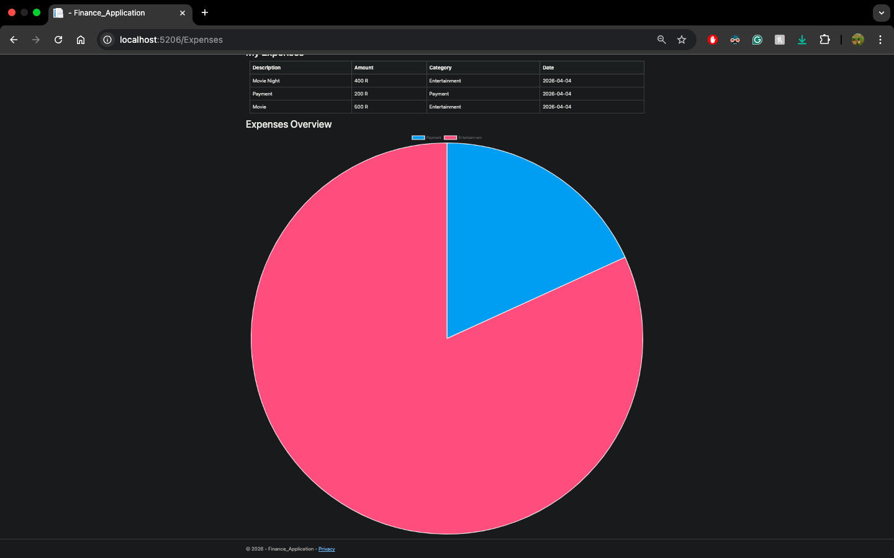
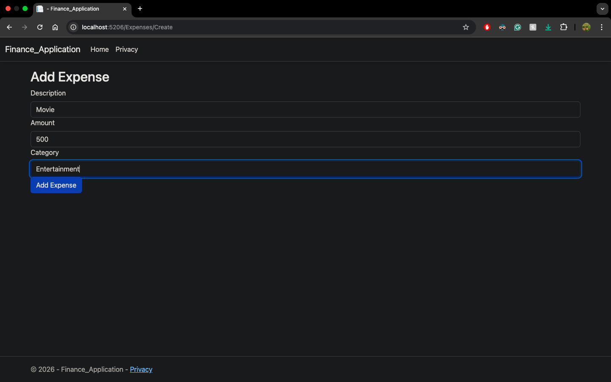

# SpendSmart

## Project Title
**SpendSmart**
An ASP.NET Core MVC and PostgreSQL application that tracks personal finances.

## Project Description
- This application tracks and categorises expenses and provides a visual chart to view expenses.
- The focus is on a full-stack MVC pattern EF Core data access, Controller actions.

## Features
- Add expenses with description, amount, category.
- Persistent storage via PostgreSQL.
- Server-side model validation.
- Expense listing on index page.
- Date defaults to current date on creation

## Planned Features/Roadmap
- Add income.
- Add savings.
- Edit and delete expenses
- Category dropdown with predefined options
- Validation error messages on form
- Filter by month/year
- Budget module with monthly cap per category
- Summary dashboard with ViewModel (total spend, spend by category, income, savings)
- Pagination
- CSV export
- User accounts via ASP.NET Core Identity
- Recurring expenses (e.g subscriptions)

## Tech Stack
- C#, .NET (10)
- ASP.NET Core MVC
- JavaScript
- Chart.js
- EF Core
- PostgreSQL
- Npgsql
- Git

## How to Run
- Clone repo
- Open in any IDE that supports C#/ ASP.NET application (Visual Studio, Rider).
- Set connection string in appsettings.json
- Run EF migrations
- Run the application

## Project Structure
Models — Expense entity and data annotations
Data — FinanceAppContext (EF Core DbContext)
Data Services — IExpensesService interface and ExpensesService implementation
Controllers — ExpensesController handling Index and Create
Views/Expenses — Index.cshtml (expense table), Create.cshtml (add form)

## Disclaimer
SpendSmart is a personal portfolio project created for educational and demonstration purposes only. It is intended to showcase technical skills in software development, design, and data handling.

## Screenshots
-
-

## AUTHOR
**Bathandwa L Maphumulo**  
Email: bmap750@gmail.com  
LinkedIn: [in/bathandwa-maphumulo-216177180](https://www.linkedin.com/in/bathandwa-maphumulo-216177180/)
