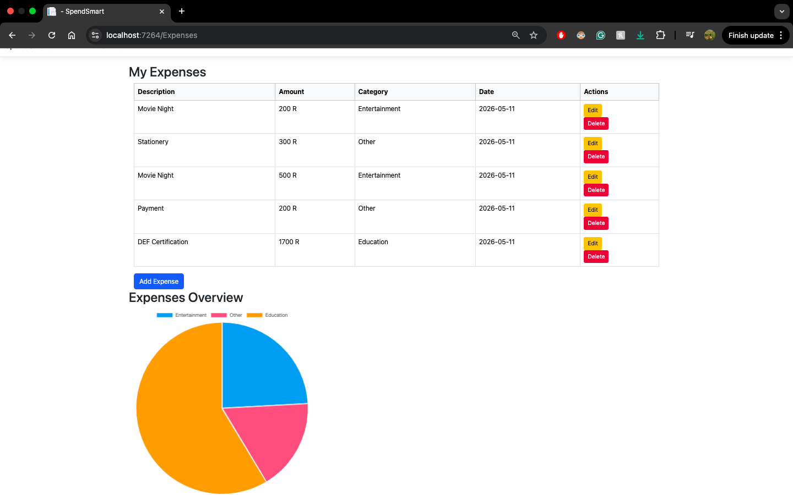
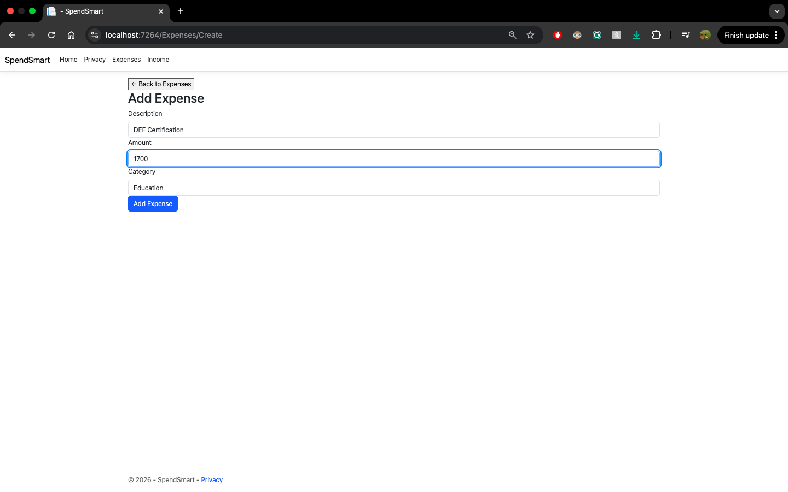
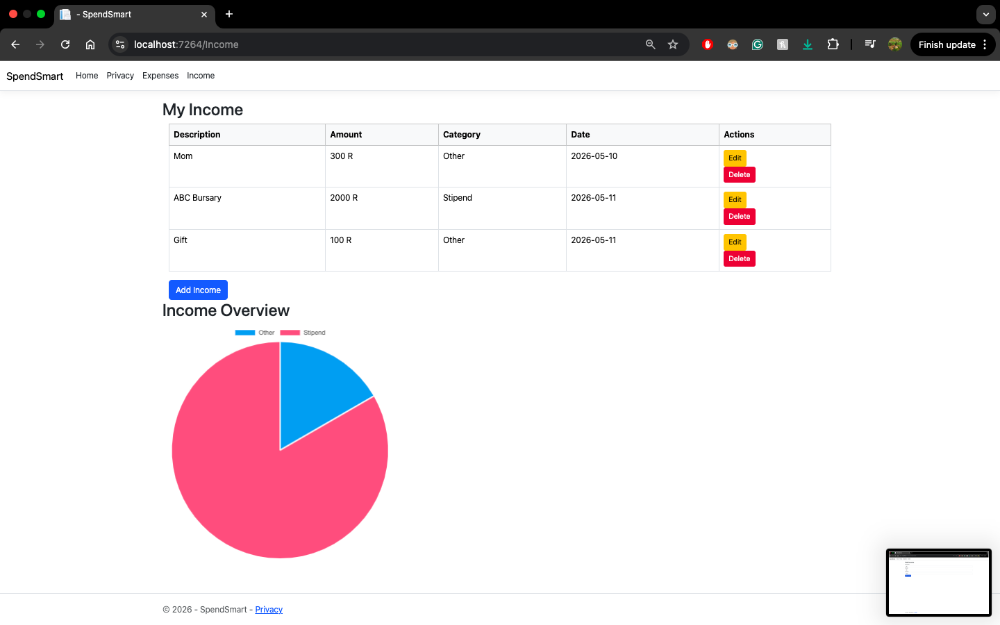
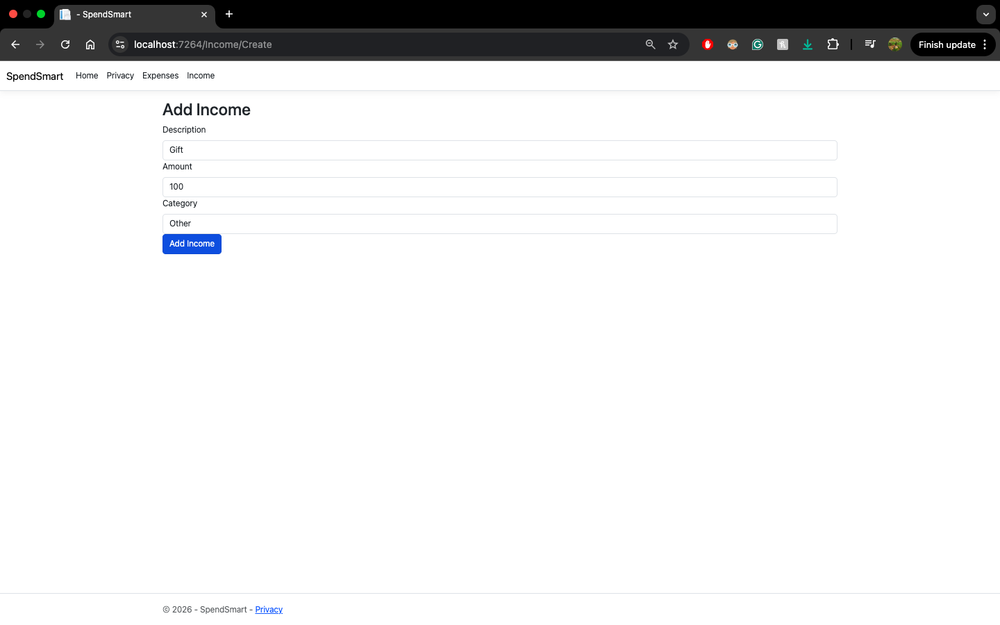
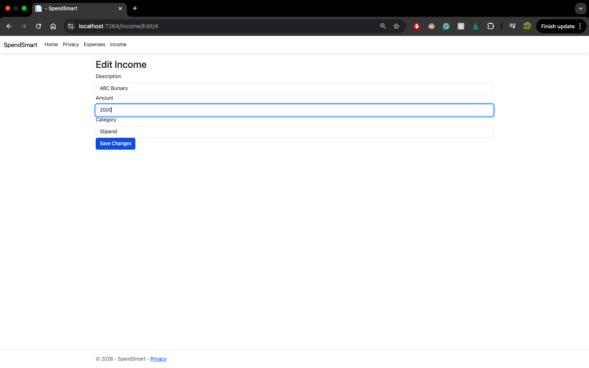

# CoinTrace

## Project Title
**CoinTrace**
An ASP.NET Core MVC and PostgreSQL application that tracks personal finances. This was based on the 
ASP.NET Core MVC Course for Beginners (.NET 9) link:https://youtu.be/RWXKysImabs?si=vrDNZxpiIHtO_omO.

## Project Description
- This application tracks and categorises expenses and provides a visual chart to view expenses.
- The focus is on a full-stack MVC pattern EF Core data access, Controller actions.


## Features
- Add expenses with description, amount, category.
- Persistent storage via PostgreSQL.
- Server-side model validation.
- Expense listing on index page.
- Date defaults to current date on creation

## Planned Features/Roadmap
- [ ] Add savings.
- [ ] Validation error messages on form
- [ ] Filter by month/year
- [ ] Budget module with monthly cap per category
- [ ] Summary dashboard with ViewModel (total spend, spend by category, income, savings)
- [ ] Pagination
- [ ] CSV export
- [ ] User accounts via ASP.NET Core Identity
- [ ] Recurring expenses (e.g subscriptions)

## Tech Stack
- C#, .NET (10)
- ASP.NET Core MVC
- JavaScript
- Chart.js
- EF Core
- PostgreSQL
- Git

## How to Run
- Clone repo
- Open in any IDE that supports C#/ ASP.NET application (Visual Studio, Rider etc).
- Set connection string in appsettings.json
- Run EF migrations
- Run the application

## Project Structure
```
Finance_Application/
├── .gitignore
├── Finance_Application/
│   ├── appsettings.Development.json
│   ├── appsettings.json
│   ├── Controllers/
│   │   ├── ExpensesController.cs
│   │   ├── HomeController.cs
│   │   └── IncomeController.cs
│   ├── Data/
│   │   ├── FinanceAppContext.cs
│   │   └── Services/
│   │       ├── ExpensesService.cs
│   │       ├── IExpensesService.cs
│   │       ├── IIncomeService.cs
│   │       └── IncomeService.cs
│   ├── Finance_Application.csproj
│   ├── Models/
│   │   ├── ErrorViewModel.cs
│   │   ├── Expense.cs
│   │   └── Income.cs
│   ├── Program.cs
│   ├── Properties/
│   │   └── launchSettings.json
│   ├── Screenshots/
│   │   ├── SpendSmartAddExpenses.png
│   │   ├── SpendSmartAddIncome.png
│   │   ├── SpendSmartEditIncome.png
│   │   ├── SpendSmartExpenseIndex.png
│   │   └── SpendSmartIncomeIndex.png
│   ├── Views/
│   │   ├── _ViewImports.cshtml
│   │   ├── _ViewStart.cshtml
│   │   ├── Expenses/
│   │   │   ├── Create.cshtml
│   │   │   ├── Edit.cshtml
│   │   │   └── Index.cshtml
│   │   ├── Home/
│   │   │   ├── Index.cshtml
│   │   │   └── Privacy.cshtml
│   │   ├── Income/
│   │   │   ├── Create.cshtml
│   │   │   ├── Edit.cshtml
│   │   │   └── Index.cshtml
│   │   └── Shared/
│   │       ├── _Layout.cshtml
│   │       ├── _Layout.cshtml.css
│   │       ├── _ValidationScriptsPartial.cshtml
│   │       └── Error.cshtml
│   └── wwwroot/
│       ├── css/
│       │   └── site.css
│       ├── favicon.ico
│       ├── js/
│       │   └── site.js
│       └── lib/
│           ├── bootstrap/
│           │   ├── dist/
│           │   │   ├── css/
│           │   │   │   ├── bootstrap-grid.css
│           │   │   │   ├── bootstrap-grid.css.map
│           │   │   │   ├── bootstrap-grid.min.css
│           │   │   │   ├── bootstrap-grid.min.css.map
│           │   │   │   ├── bootstrap-grid.rtl.css
│           │   │   │   ├── bootstrap-grid.rtl.css.map
│           │   │   │   ├── bootstrap-grid.rtl.min.css
│           │   │   │   ├── bootstrap-grid.rtl.min.css.map
│           │   │   │   ├── bootstrap-reboot.css
│           │   │   │   ├── bootstrap-reboot.css.map
│           │   │   │   ├── bootstrap-reboot.min.css
│           │   │   │   ├── bootstrap-reboot.min.css.map
│           │   │   │   ├── bootstrap-reboot.rtl.css
│           │   │   │   ├── bootstrap-reboot.rtl.css.map
│           │   │   │   ├── bootstrap-reboot.rtl.min.css
│           │   │   │   ├── bootstrap-reboot.rtl.min.css.map
│           │   │   │   ├── bootstrap-utilities.css
│           │   │   │   ├── bootstrap-utilities.css.map
│           │   │   │   ├── bootstrap-utilities.min.css
│           │   │   │   ├── bootstrap-utilities.min.css.map
│           │   │   │   ├── bootstrap-utilities.rtl.css
│           │   │   │   ├── bootstrap-utilities.rtl.css.map
│           │   │   │   ├── bootstrap-utilities.rtl.min.css
│           │   │   │   ├── bootstrap-utilities.rtl.min.css.map
│           │   │   │   ├── bootstrap.css
│           │   │   │   ├── bootstrap.css.map
│           │   │   │   ├── bootstrap.min.css
│           │   │   │   ├── bootstrap.min.css.map
│           │   │   │   ├── bootstrap.rtl.css
│           │   │   │   ├── bootstrap.rtl.css.map
│           │   │   │   ├── bootstrap.rtl.min.css
│           │   │   │   └── bootstrap.rtl.min.css.map
│           │   │   └── js/
│           │   │       ├── bootstrap.bundle.js
│           │   │       ├── bootstrap.bundle.js.map
│           │   │       ├── bootstrap.bundle.min.js
│           │   │       ├── bootstrap.bundle.min.js.map
│           │   │       ├── bootstrap.esm.js
│           │   │       ├── bootstrap.esm.js.map
│           │   │       ├── bootstrap.esm.min.js
│           │   │       ├── bootstrap.esm.min.js.map
│           │   │       ├── bootstrap.js
│           │   │       ├── bootstrap.js.map
│           │   │       ├── bootstrap.min.js
│           │   │       └── bootstrap.min.js.map
│           │   └── LICENSE
│           ├── jquery/
│           │   ├── dist/
│           │   │   ├── jquery.js
│           │   │   ├── jquery.min.js
│           │   │   ├── jquery.min.map
│           │   │   ├── jquery.slim.js
│           │   │   ├── jquery.slim.min.js
│           │   │   └── jquery.slim.min.map
│           │   └── LICENSE.txt
│           ├── jquery-validation/
│           │   ├── dist/
│           │   │   ├── additional-methods.js
│           │   │   ├── additional-methods.min.js
│           │   │   ├── jquery.validate.js
│           │   │   └── jquery.validate.min.js
│           │   └── LICENSE.md
│           └── jquery-validation-unobtrusive/
│               ├── dist/
│               │   ├── jquery.validate.unobtrusive.js
│               │   └── jquery.validate.unobtrusive.min.js
│               └── LICENSE.txt
├── Finance_Application.sln
├── MyMoney_ExpenseCreatePage.png
├── MyMoney_ExpenseIndexPage.png
├── README.md
└── Screenshots

```

## Disclaimer
CoinTrace is a personal portfolio project created for educational and demonstration purposes only. It is intended to showcase technical skills in software development, design, and data handling.

## Screenshots
- Expense page


- Add Expense Page


- Income Page


- Add Income Page


- Edit Income Page


## AUTHOR
**Bathandwa L Maphumulo**  
Email: bmap750@gmail.com  
LinkedIn: [in/bathandwa-maphumulo-216177180](https://www.linkedin.com/in/bathandwa-maphumulo-216177180/)
